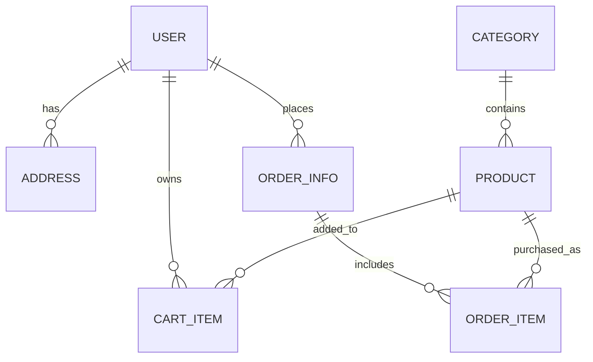

# 03-数据库设计

## 实体说明

- USER：系统用户，区分普通用户和管理员。
- CATEGORY：商品分类。
- PRODUCT：商品基础信息、价格、库存、销量。
- CART_ITEM：购物车项，同一用户同一商品唯一。
- ADDRESS：用户收货地址。
- ORDER_INFO：订单主表，保存订单状态、收货地址快照、付款备注、物流单号和关键流转时间。
- ORDER_ITEM：订单明细，保存商品名称、价格、图片快照。

## E-R 图



## 关系模型

- USER(id, username, password, phone, email, role, status, session_version, last_login_time, last_password_update_time, create_time, update_time)
- CATEGORY(id, name, sort_order, status, create_time, update_time)
- PRODUCT(id, category_id, name, price, stock, sales, image_url, description, status, create_time, update_time)
- CART_ITEM(id, user_id, product_id, quantity, create_time, update_time)
- ADDRESS(id, user_id, receiver_name, receiver_phone, province, city, detail_address, is_default, create_time, update_time)
- ORDER_INFO(id, order_no, user_id, total_amount, status, receiver_name, receiver_phone, receiver_address, payment_note, admin_remark, shipping_no, pay_time, ship_time, finish_time, cancel_time, confirm_time, create_time, update_time)
- ORDER_ITEM(id, order_id, product_id, product_name, product_price, quantity, total_price, product_image, create_time)

## 约束与索引

- `user.username` 唯一，防止重复注册。
- `user.session_version` 非负，JWT 中的会话版本必须与数据库一致；修改密码、退出登录或禁用用户时递增，使旧 Token 失效。
- `cart_item(user_id, product_id)` 联合唯一，保证同一用户同一商品只有一条购物车记录。
- `order_info.order_no` 唯一，保证订单号可追踪。
- 商品价格、库存、销量使用 `CHECK` 约束限制非负。
- 购物车数量和订单明细数量使用 `CHECK` 约束限制大于 0。
- 常用查询字段建立索引：商品分类、商品名称、商品状态、订单状态、订单创建时间。

## 数据完整性设计

- 商品必须关联有效分类。
- 购物车项必须关联有效用户和商品。
- 地址必须属于用户。
- 订单必须属于用户。
- 订单明细必须属于订单，并关联商品。
- 删除商品和分类时优先采用状态控制，避免破坏历史订单外键。

## 事务设计

订单创建使用 `@Transactional` 保证以下操作原子性：

1. 创建订单主表。
2. 创建订单明细。
3. 扣减商品库存并增加销量。
4. 删除已购买购物车项。

库存扣减使用安全 SQL：

```sql
UPDATE product
SET stock = stock - #{quantity}, sales = sales + #{quantity}
WHERE id = #{productId}
  AND stock >= #{quantity}
  AND status = 1;
```

如果影响行数为 0，说明库存不足或商品不可购买，后端抛出业务异常并回滚事务。

取消待支付订单也在事务中执行，按照订单明细恢复库存并回退销量，避免待支付订单取消后库存长期被占用。
