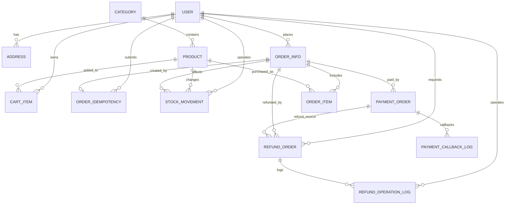

# 03-数据库设计

## 实体说明

- USER：系统用户，区分普通用户和管理员。
- CATEGORY：商品分类。
- PRODUCT：商品基础信息、价格、库存、销量。
- STOCK_MOVEMENT：库存流水，记录下单扣减、取消恢复和管理员调库存。
- CART_ITEM：购物车项，同一用户同一商品唯一。
- ADDRESS：用户收货地址。
- ORDER_INFO：订单主表，保存订单状态、收货地址快照、付款备注、物流单号和关键流转时间。
- PAYMENT_ORDER：支付单，为线下收款确认和后续真实支付接入保存支付记录。
- PAYMENT_CALLBACK_LOG：支付回调日志，为后续第三方支付回调验签和幂等处理预留。
- REFUND_ORDER：退款售后单，记录退款申请、审核、退款状态和库存恢复标记。
- REFUND_OPERATION_LOG：退款售后操作日志，记录用户、管理员或系统触发的状态流转。
- ORDER_IDEMPOTENCY：订单创建幂等表，记录用户提交订单时的 `requestId` 和已生成订单。
- ORDER_ITEM：订单明细，保存商品名称、价格、图片快照。

## E-R 图



## 关系模型

- USER(id, username, password, phone, email, role, status, session_version, last_login_time, last_password_update_time, create_time, update_time)
- CATEGORY(id, name, sort_order, status, create_time, update_time)
- PRODUCT(id, category_id, name, price, stock, sales, image_url, description, status, create_time, update_time)
- STOCK_MOVEMENT(id, product_id, order_id, movement_type, quantity, before_stock, after_stock, operator_id, remark, create_time)
- CART_ITEM(id, user_id, product_id, quantity, create_time, update_time)
- ADDRESS(id, user_id, receiver_name, receiver_phone, province, city, detail_address, is_default, create_time, update_time)
- ORDER_INFO(id, order_no, user_id, total_amount, status, receiver_name, receiver_phone, receiver_address, payment_note, admin_remark, shipping_no, pay_time, ship_time, finish_time, cancel_time, confirm_time, create_time, update_time)
- PAYMENT_ORDER(id, order_id, order_no, payment_no, channel, amount, status, paid_time, third_party_trade_no, create_time, update_time)
- PAYMENT_CALLBACK_LOG(id, payment_no, channel, event_type, raw_payload, verify_result, process_result, create_time)
- REFUND_ORDER(id, refund_no, order_id, order_no, user_id, payment_no, apply_type, refund_amount, reason, status, refund_channel, third_party_refund_no, stock_restore_required, stock_restored, admin_remark, apply_time, audit_time, refund_time, finish_time, create_time, update_time)
- REFUND_OPERATION_LOG(id, refund_id, refund_no, operator_id, operator_role, from_status, to_status, action, remark, create_time)
- ORDER_IDEMPOTENCY(id, user_id, request_id, order_id, status, create_time, update_time)
- ORDER_ITEM(id, order_id, product_id, product_name, product_price, quantity, total_price, product_image, create_time)

## 约束与索引

- `user.username` 唯一，防止重复注册。
- `user.session_version` 非负，JWT 中的会话版本必须与数据库一致；修改密码、退出登录或禁用用户时递增，使旧 Token 失效。
- `cart_item(user_id, product_id)` 联合唯一，保证同一用户同一商品只有一条购物车记录。
- `order_info.order_no` 唯一，保证订单号可追踪。
- `order_idempotency(user_id, request_id)` 联合唯一，保证同一用户同一请求幂等号只对应一次订单创建。
- `stock_movement(product_id, create_time)` 支持按商品追踪库存变化；`stock_movement(order_id)` 支持从订单追溯库存扣减和恢复。
- `payment_order.payment_no` 唯一，保证支付单号可追踪；`payment_order(order_id)` 支持按订单查询支付记录。
- `payment_callback_log(payment_no)` 支持按支付单追踪回调事件。
- `refund_order.refund_no` 唯一，保证退款单号可追踪；`refund_order(order_id)` 支持按订单查询售后记录。
- `refund_order(user_id, status)` 支持用户侧售后列表和后台按状态筛选。
- `refund_operation_log(refund_id)` 和 `refund_operation_log(refund_no)` 支持追踪退款单状态流转。
- 商品价格、库存、销量使用 `CHECK` 约束限制非负。
- 购物车数量和订单明细数量使用 `CHECK` 约束限制大于 0。
- 常用查询字段建立索引：商品分类、商品名称、商品状态、订单状态、订单创建时间。

## 数据完整性设计

- 商品必须关联有效分类。
- 购物车项必须关联有效用户和商品。
- 地址必须属于用户。
- 订单必须属于用户。
- 订单创建幂等记录必须属于用户；成功幂等记录可关联已创建订单。
- 库存流水必须关联商品，可选关联订单和操作用户。
- 支付单必须关联订单；回调日志按支付单号记录原始回调摘要或安全处理后的 payload。
- 退款售后单必须关联订单和用户，可选关联原支付单；退款金额必须大于 0，状态只能在定义范围内流转。
- 退款操作日志必须关联退款单，可选关联操作用户，操作角色限制为 `USER`、`ADMIN` 或 `SYSTEM`。
- 订单明细必须属于订单，并关联商品。
- 删除商品和分类时优先采用状态控制，避免破坏历史订单外键。

## 事务设计

订单创建使用 `@Transactional` 保证以下操作原子性：

1. 写入 `order_idempotency`，声明本次 `requestId`。
2. 校验并声明清理购物车项，避免同一购物车项被不同请求重复结算。
3. 创建订单主表。
4. 创建订单明细。
5. 扣减商品库存并增加销量。
6. 更新幂等记录为成功并关联订单。

如果同一用户使用同一 `requestId` 重复提交，后端直接返回首次创建的订单结果；如果使用不同 `requestId` 重复结算已经被清理的购物车项，后端返回业务错误。

库存变化会同步写入 `stock_movement`：

- `ORDER_DECREASE`：下单成功后记录扣减数量、扣减前后库存、订单 ID 和用户 ID。
- `ORDER_CANCEL_RESTORE`：取消待支付订单恢复库存时记录恢复数量、恢复前后库存、订单 ID 和用户 ID。
- `ADMIN_ADJUST`：管理员编辑商品库存或通过库存弹窗调整库存时记录调整量、调整前后库存和管理员 ID。

当前项目仍采用线下付款备注和管理员确认收款。管理员确认收款时，后端会生成一条 `payment_order`：

- `channel = OFFLINE`
- `status = 1`，表示支付成功
- `amount = order_info.total_amount`
- `third_party_trade_no` 暂存用户填写的付款备注

`payment_callback_log` 目前用于后续真实支付接入预留。真实回调接入时必须校验签名、订单金额、订单状态，并保证重复回调只处理一次。

`refund_order` 和 `refund_operation_log` 目前用于退款售后流程预留。后续接入业务接口时建议按以下状态流转：

- `0`：申请中
- `1`：审核通过
- `2`：审核拒绝
- `3`：退款中
- `4`：退款成功
- `5`：退款失败
- `6`：已取消

已支付未发货取消可以进入仅退款流程；已发货订单应进入退货退款或人工审核流程。是否恢复库存由 `stock_restore_required` 和 `stock_restored` 标记控制，实际恢复库存时应同步写入 `stock_movement`，避免退款和库存审计脱节。

库存扣减使用安全 SQL：

```sql
UPDATE product
SET stock = stock - #{quantity}, sales = sales + #{quantity}
WHERE id = #{productId}
  AND stock >= #{quantity}
  AND status = 1;
```

如果影响行数为 0，说明库存不足或商品不可购买，后端抛出业务异常并回滚事务。

取消待支付订单也在事务中执行，按照订单明细恢复库存并回退销量，避免待支付订单取消后库存长期被占用。
