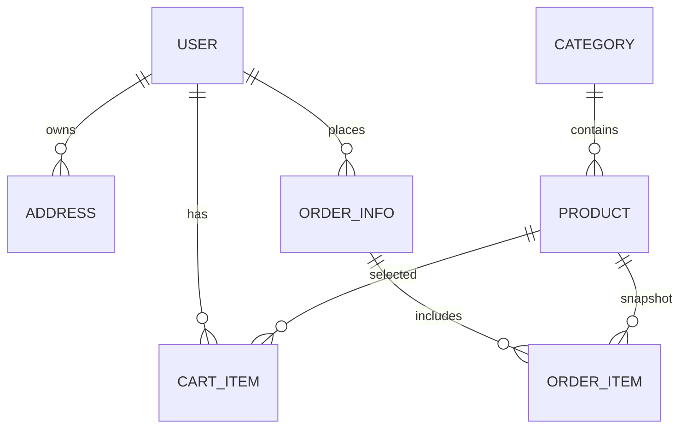

# 给 Codex 的后续开发指导 Prompt

> 用法：将下方「Prompt 正文」完整复制给 Codex。  
> 目标：让 Codex 基于当前仓库 `morisa28/my-DB`，继续把数据库课程线上商城项目从“可演示”推进到“可小规模上线/内测”的状态。

---

## Prompt 正文

你是本项目的后续开发助手。请基于 GitHub 仓库：

```text
https://github.com/morisa28/my-DB
```

当前项目是一个线上商城平台，技术栈大致为：

```text
后端：Spring Boot 3 + Java 17 + MyBatis-Plus + MySQL 8 + JWT + BCrypt
前端：Vue 3 + Vite + Pinia + Axios + Element Plus
部署：Docker Compose + Nginx 前端代理 + MySQL 初始化镜像
```

项目当前已经具备用户注册登录、商品分类、商品浏览、购物车、地址、订单创建、线下付款备注、管理员确认收款、发货、确认收货、取消订单恢复库存、后台商品/分类/订单/用户管理、订单操作日志、后台操作日志、Docker Compose 运行等能力。

你的任务不是从零重写项目，而是在现有基础上继续加固、补齐、测试和文档化。请优先检查当前仓库实际状态，再决定哪些任务已经完成、哪些仍需开发。不要重复实现已经完成且正确的功能。

---

# 一、总目标

将项目从“数据库课程大作业/本地演示项目”推进为“可以安全进行小规模线上内测的商城项目”。

重点不是堆新功能，而是补齐以下方面：

```text
1. 生产部署安全
2. 登录鉴权安全
3. 订单与库存并发一致性
4. 支付/退款/售后的数据模型扩展
5. 数据库迁移与备份恢复
6. 自动化测试与 CI/CD
7. 文件上传安全
8. 日志、监控、健康检查和可观测性
9. 前端健壮性、错误处理和移动端体验
10. 数据库课程答辩材料完善
```

---

# 二、工作原则

## 2.1 先审查，再修改

开始写代码前，先检查以下内容：

```text
README.md
LICENSE
docker-compose.yml
docker-compose.prod.yml
.env.example
mall-mysql/Dockerfile
mall-backend/pom.xml
mall-backend/src/main/resources/application.yml
mall-backend/src/main/resources/application-prod.yml
mall-backend/src/main/resources/sql/schema.sql
mall-backend/src/main/resources/sql/migration/
mall-backend/src/main/java/com/example/mall/
mall-frontend/package.json
mall-frontend/src/
scripts/
docs/
```

尤其要阅读这些文档，确认哪些隐患已经修复：

```text
docs/17-整体隐患审查报告.md
docs/19-阶段十二-订单并发幂等修复.md
docs/22-阶段十五-后台操作审计与迁移追踪.md
```

如果某个文档中提到的问题已经在当前代码里修复，请不要重复实现；应在新的阶段文档中说明“已确认完成”。

## 2.2 不要破坏已有主流程

必须保持以下核心流程可用：

```text
用户注册 -> 登录 -> 浏览商品 -> 加入购物车 -> 填写地址 -> 创建订单
用户提交付款备注 -> 管理员确认收款 -> 管理员发货 -> 用户确认收货
用户取消待支付订单 -> 库存和销量正确恢复
管理员管理商品、分类、订单、用户、操作日志
```

除非有明确理由，不要随意改变已有 API 路径、请求字段和响应结构。确实需要变更时，要同步修改前端、测试脚本和文档。

## 2.3 安全优先

禁止提交任何真实密钥、真实密码、真实 token、真实服务器地址。  
禁止在日志、异常、审计记录中输出密码、JWT、完整 Authorization Header、数据库密码或敏感个人信息。

生产环境必须避免：

```text
默认 root 密码
默认 JWT secret
CORS_ALLOWED_ORIGINS=*
MySQL 端口暴露到公网
应用使用 MySQL root 账号连接数据库
生产库执行 DROP DATABASE
前端或后端泄露内部异常堆栈
```

## 2.4 小步提交，阶段验收

每完成一个阶段，必须：

```text
1. 说明修改了哪些文件
2. 说明为什么这样修改
3. 说明风险和兼容性影响
4. 运行必要的测试/构建/检查命令
5. 新增或更新 docs/ 下的阶段文档
```

建议新增阶段文档，例如：

```text
docs/23-生产安全与CI加固.md
docs/24-支付售后与库存流水设计.md
docs/25-监控备份与上线验收.md
```

---

# 三、优先级路线图

## P0：现状复核与问题归档

先完成一次仓库复核，不急着写代码。

请输出：

```text
1. 当前分支、最近提交、工作区状态
2. 后端、前端、Docker、数据库脚本是否可构建/可运行
3. docs/17 中哪些问题已经修复，哪些仍然存在
4. 当前最高风险的 5 个问题
5. 建议本轮开发优先做哪些任务
```

命令建议：

```bash
git status
git branch --show-current
git log --oneline -5
git diff --check
```

如果本地环境允许，继续执行：

```bash
cd mall-backend && mvn -B test
cd ../mall-frontend && npm ci && npm run build
cd .. && docker compose config --quiet
```

---

## P1：生产部署安全加固

目标：确保项目不会因为误用 demo 配置而危险上线。

### 必做项

1. 检查 `docker-compose.prod.yml` 是否强制要求生产变量：

```text
MYSQL_ROOT_PASSWORD
MYSQL_USER
MYSQL_PASSWORD
JWT_SECRET
CORS_ALLOWED_ORIGINS
```

2. 生产 compose 中不要映射 MySQL 到宿主公网端口。  
3. 后端生产环境必须使用非 root 数据库用户。  
4. `.env.prod.example` 中只放占位示例，不放可直接使用的弱密码。  
5. `README.md` 和部署文档必须明确区分：

```text
docker-compose.yml           仅本地演示/开发
docker-compose.prod.yml      生产/服务器部署
```

6. 生产环境启动前必须检查：

```text
JWT_SECRET 长度 >= 32 字节
CORS_ALLOWED_ORIGINS 不能为 *
DB_USERNAME 不能为 root
SPRING_PROFILES_ACTIVE 必须为 prod
```

可以通过启动校验类或配置校验实现。

### 建议新增

新增一个生产配置自检组件，例如：

```text
mall-backend/src/main/java/com/example/mall/config/ProductionSafetyChecker.java
```

当 `SPRING_PROFILES_ACTIVE=prod` 时，如果检测到危险配置，应用直接启动失败并给出明确错误。

需要检查的危险配置：

```text
JWT_SECRET 为空、过短或仍是 demo 值
CORS_ALLOWED_ORIGINS 为空或包含 *
DB_USERNAME=root
DB_PASSWORD 为空或明显是 demo 值
```

### 验收标准

```bash
docker compose -f docker-compose.prod.yml --env-file .env.prod config --quiet
```

在故意设置危险变量时，后端应启动失败；设置安全变量时，后端应正常启动。

---

## P2：登录鉴权与会话安全

目标：从“能登录和鉴权”升级为“具备基础上线安全能力”。

### 当前风险

项目当前使用 JWT 拦截器做登录校验和管理员权限判断。这个方案基础可用，但还需要补：

```text
登录失败限流
密码复杂度
退出登录后的 token 失效
修改密码后的旧 token 失效
禁用用户后的旧 token 失效
refresh token 或 sessionVersion
管理员敏感操作二次确认
```

### 必做项

1. 用户表增加会话版本字段，例如：

```sql
session_version INT NOT NULL DEFAULT 0
last_login_time DATETIME NULL
last_password_update_time DATETIME NULL
```

2. JWT 中加入 `sessionVersion`。  
3. 每次解析 JWT 后，除了查用户状态，还要比较 token 中的 `sessionVersion` 与数据库当前值。  
4. 用户修改密码、管理员禁用用户、用户主动退出登录时，让旧 token 失效。  
5. 登录失败增加限流。可先用内存限流，后续再换 Redis。  
6. 注册和修改密码增加密码复杂度要求：

```text
长度至少 8 位
至少包含字母和数字
建议包含特殊字符
不能等于用户名
```

7. 后端错误响应不要透露“用户名存在但密码错”之类有助于枚举账号的信息。

### 可选增强

如果改动范围可控，可以将前端 localStorage token 方案升级为：

```text
HttpOnly Cookie + SameSite + CSRF Token
```

如果短期不改 Cookie，至少：

```text
缩短 access token 过期时间
增加 refresh token 或 sessionVersion
添加 CSP 响应头
避免任何用户输入内容作为未转义 HTML 渲染
```

### 验收标准

必须测试：

```text
1. 正确登录成功
2. 错误密码多次登录被限流
3. 修改密码后旧 token 失效
4. 禁用用户后旧 token 失效
5. 普通用户访问后台返回 403
6. 未登录访问订单/购物车返回 401
7. 管理员不能禁用自己
```

---

## P3：订单、库存、支付和售后模型增强

目标：把订单链路从“线下付款演示”扩展为“可继续接入真实支付”的结构。

### 3.1 下单幂等

当前订单创建已经通过购物车行声明、事务、安全扣减库存、状态条件更新降低并发风险，但仍应补客户端幂等键。

新增：

```text
requestId 或 checkoutToken
order_idempotency 表，或在 order_info 中增加 request_id 唯一约束
```

建议表结构：

```sql
CREATE TABLE order_idempotency (
    id BIGINT PRIMARY KEY AUTO_INCREMENT,
    user_id BIGINT NOT NULL,
    request_id VARCHAR(64) NOT NULL,
    order_id BIGINT,
    status TINYINT NOT NULL DEFAULT 0,
    create_time DATETIME NOT NULL DEFAULT CURRENT_TIMESTAMP,
    update_time DATETIME NOT NULL DEFAULT CURRENT_TIMESTAMP ON UPDATE CURRENT_TIMESTAMP,
    UNIQUE KEY uk_order_idempotency_user_request (user_id, request_id)
);
```

要求：

```text
同一用户使用同一个 requestId 重复提交，不得生成多笔订单。
如果首次提交已成功，应返回同一订单结果。
如果首次提交失败，应允许按规则重试或返回明确错误。
```

### 3.2 库存流水

新增库存流水表：

```sql
CREATE TABLE stock_movement (
    id BIGINT PRIMARY KEY AUTO_INCREMENT,
    product_id BIGINT NOT NULL,
    order_id BIGINT,
    movement_type VARCHAR(32) NOT NULL,
    quantity INT NOT NULL,
    before_stock INT,
    after_stock INT,
    operator_id BIGINT,
    remark VARCHAR(255),
    create_time DATETIME NOT NULL DEFAULT CURRENT_TIMESTAMP,
    KEY idx_stock_movement_product_time (product_id, create_time),
    KEY idx_stock_movement_order (order_id)
);
```

至少记录：

```text
ORDER_DECREASE      下单扣库存
ORDER_CANCEL_RESTORE 取消待支付订单恢复库存
ADMIN_ADJUST        管理员手动调整库存
```

### 3.3 支付单和回调日志

当前项目是线下付款备注 + 管理员确认收款。先不要强行接真实支付，但要把数据结构预留好。

新增支付单表：

```sql
CREATE TABLE payment_order (
    id BIGINT PRIMARY KEY AUTO_INCREMENT,
    order_id BIGINT NOT NULL,
    order_no VARCHAR(64) NOT NULL,
    payment_no VARCHAR(64) NOT NULL,
    channel VARCHAR(32) NOT NULL,
    amount DECIMAL(10,2) NOT NULL,
    status TINYINT NOT NULL DEFAULT 0 COMMENT '0待支付 1成功 2失败 3关闭 4退款中 5已退款',
    paid_time DATETIME,
    third_party_trade_no VARCHAR(128),
    create_time DATETIME NOT NULL DEFAULT CURRENT_TIMESTAMP,
    update_time DATETIME NOT NULL DEFAULT CURRENT_TIMESTAMP ON UPDATE CURRENT_TIMESTAMP,
    UNIQUE KEY uk_payment_no (payment_no),
    KEY idx_payment_order_id (order_id)
);
```

新增回调日志表：

```sql
CREATE TABLE payment_callback_log (
    id BIGINT PRIMARY KEY AUTO_INCREMENT,
    payment_no VARCHAR(64) NOT NULL,
    channel VARCHAR(32) NOT NULL,
    event_type VARCHAR(64),
    raw_payload TEXT,
    verify_result TINYINT NOT NULL DEFAULT 0,
    process_result TINYINT NOT NULL DEFAULT 0,
    create_time DATETIME NOT NULL DEFAULT CURRENT_TIMESTAMP,
    KEY idx_callback_payment_no (payment_no)
);
```

要求：

```text
支付回调必须幂等。
必须校验订单金额。
必须校验订单状态。
必须保存原始回调摘要或安全处理后的 payload。
不得在日志中保存密钥。
```

### 3.4 售后和退款

新增售后表或先做基础设计文档：

```text
refund_order
refund_operation_log
```

至少要考虑：

```text
已支付未发货取消
已发货退款申请
管理员审核
退款中
退款成功/失败
库存是否恢复
```

### 验收标准

必须补测试：

```text
1. 同 requestId 重复下单只生成一笔订单
2. 并发结算同一购物车项只成功一次
3. 库存不足下单失败且不生成脏订单
4. 待支付取消只恢复一次库存
5. 已支付订单不能走待支付取消逻辑
6. 支付成功回调重复到达只处理一次
```

---

## P4：数据库迁移、备份和恢复

目标：避免生产库误删、漏迁移、无法恢复。

### 必做项

1. 引入 Flyway 或 Liquibase。优先建议 Flyway，改动较小。  
2. 将现有 schema 初始化和增量 migration 规范化。  
3. 生产环境禁止执行 `DROP DATABASE IF EXISTS mall_db`。  
4. 文档中明确：

```text
本地全新初始化可以使用 schema.sql
demo 环境可以清空重建
生产环境只能执行版本化 migration
生产环境操作前必须备份
```

5. 增加备份脚本：

```text
scripts/backup-db.sh
scripts/restore-db.sh
scripts/backup-uploads.sh
```

6. 增加备份恢复演练文档：

```text
docs/backup-and-restore.md
```

### 备份脚本要求

至少支持：

```text
导出 MySQL 数据库
压缩备份文件
保留最近 N 天备份
备份上传目录
恢复到临时数据库验证
```

不要把备份文件提交到 Git。

### 验收标准

```bash
# 示例，不要求命令完全相同，但必须能完成等价验证
bash scripts/backup-db.sh
bash scripts/backup-uploads.sh
bash scripts/restore-db.sh ./backup/xxx.sql.gz
```

并在文档中说明：

```text
如何备份
如何恢复
如何验证恢复是否成功
哪些命令不能在生产环境执行
```

---

## P5：自动化测试与 CI/CD

目标：让项目后续修改不会悄悄破坏核心功能。

### 后端测试

新增或完善：

```text
mall-backend/src/test/java/...
```

测试优先级：

```text
1. 用户登录、注册、禁用、修改密码
2. JWT 鉴权和管理员权限
3. 商品分页、搜索、低库存
4. 购物车唯一约束和数量校验
5. 下单事务、库存扣减、库存不足失败
6. 订单状态流转：待支付 -> 已支付 -> 已发货 -> 已完成
7. 取消待支付订单恢复库存
8. 并发重复下单、重复取消、重复确认收货
9. 上传文件格式、大小、伪装扩展名
10. 后台操作审计日志
```

建议使用：

```text
JUnit 5
SpringBootTest
MockMvc
Testcontainers MySQL，或专用测试数据库
```

### 前端测试

至少保证：

```text
npm run build 通过
登录页可打开
首页商品列表非空白
管理员页面守卫有效
订单详情页正常展示
后台操作日志页面正常展示
```

如果项目已有 `scripts/frontend-smoke-check.mjs`，继续强化它；如果没有，则新增基于 Playwright 的冒烟脚本。

### CI

新增：

```text
.github/workflows/ci.yml
```

CI 至少包含：

```text
1. backend-test
2. frontend-build
3. docker-compose-config-check
4. optional: e2e-smoke
```

建议 workflow：

```yaml
name: CI

on:
  push:
  pull_request:

jobs:
  backend:
    runs-on: ubuntu-latest
    steps:
      - uses: actions/checkout@v4
      - uses: actions/setup-java@v4
        with:
          distribution: temurin
          java-version: '17'
      - name: Backend test
        working-directory: mall-backend
        run: mvn -B test

  frontend:
    runs-on: ubuntu-latest
    steps:
      - uses: actions/checkout@v4
      - uses: actions/setup-node@v4
        with:
          node-version: '20'
          cache: npm
          cache-dependency-path: mall-frontend/package-lock.json
      - name: Frontend install
        working-directory: mall-frontend
        run: npm ci
      - name: Frontend build
        working-directory: mall-frontend
        run: npm run build

  compose:
    runs-on: ubuntu-latest
    steps:
      - uses: actions/checkout@v4
      - name: Docker compose config check
        run: docker compose config --quiet
```

如果加入 Testcontainers 或 Docker E2E，需要根据实际环境调整。

### 验收标准

```bash
git diff --check
cd mall-backend && mvn -B test
cd ../mall-frontend && npm ci && npm run build
cd .. && docker compose config --quiet
```

CI 在 GitHub Actions 上通过。

---

## P6：文件上传安全和文件治理

目标：防止恶意上传、伪装图片、孤儿文件长期堆积。

### 必做项

1. 上传接口只允许管理员调用。  
2. 除扩展名外，还要校验 MIME 和 magic number。  
3. 上传文件统一随机命名，不使用原文件名。  
4. 图片可重编码后保存，去除潜在恶意内容。  
5. 上传目录禁止执行脚本。  
6. 限制文件大小和请求大小。  
7. 记录上传审计日志。  
8. 增加孤儿文件清理机制：商品图片被替换后，旧图进入待清理列表；定期删除未被任何商品引用的文件。

### 建议新增表

```sql
CREATE TABLE uploaded_file (
    id BIGINT PRIMARY KEY AUTO_INCREMENT,
    file_url VARCHAR(255) NOT NULL,
    storage_path VARCHAR(500) NOT NULL,
    original_name VARCHAR(255),
    content_type VARCHAR(100),
    file_size BIGINT NOT NULL,
    sha256 VARCHAR(64),
    ref_type VARCHAR(50),
    ref_id BIGINT,
    status TINYINT NOT NULL DEFAULT 1 COMMENT '1有效 0待清理 2已删除',
    uploader_id BIGINT NOT NULL,
    create_time DATETIME NOT NULL DEFAULT CURRENT_TIMESTAMP,
    update_time DATETIME NOT NULL DEFAULT CURRENT_TIMESTAMP ON UPDATE CURRENT_TIMESTAMP,
    KEY idx_uploaded_file_ref (ref_type, ref_id),
    KEY idx_uploaded_file_status_time (status, create_time)
);
```

### 验收标准

测试以下场景：

```text
1. 非管理员上传失败
2. 超大文件上传失败
3. txt 改名 png 上传失败
4. 正常 png/jpg/webp 上传成功
5. 替换商品图片后旧图片被标记为待清理
6. 清理任务不会删除仍被商品引用的图片
```

---

## P7：日志、监控和可观测性

目标：上线后能知道系统是否健康、哪里出错、如何排查。

### 必做项

1. 引入 requestId：每个请求生成或透传 `X-Request-Id`。  
2. 后端日志包含 requestId、用户 ID、接口路径、状态码、耗时。  
3. 500 错误返回统一文案，不暴露内部异常。  
4. 增加慢接口日志，例如超过 1 秒输出 warning。  
5. 增加 Actuator 或自定义 metrics。  
6. `/api/health` 只表示进程存活。  
7. `/api/ready` 表示数据库等依赖可用。  
8. Docker healthcheck 使用 `/api/ready`。  
9. 文档说明 health 与 ready 的区别。

### 可选项

```text
Prometheus metrics
Grafana dashboard
日志按天滚动
错误日志聚合
慢 SQL 记录
数据库连接池指标
磁盘空间告警
```

### 验收标准

```bash
curl http://localhost:8088/api/health
curl http://localhost:8088/api/ready
```

当 MySQL 不可用时：

```text
/api/health 可以仍为 200
/api/ready 必须为 503
业务接口不能伪装成功
```

---

## P8：前端健壮性和体验优化

目标：减少“能用但不稳”的体验问题。

### 必做项

1. 增加 404 页面。  
2. 增加全局错误页或友好错误提示。  
3. 所有列表页增加 loading、empty、error 状态。  
4. 订单提交按钮增加防重复点击。  
5. 下单时生成 requestId，并随请求发送。  
6. 管理员订单详情增加状态时间线。  
7. 后台商品、订单、日志页增加更完整筛选。  
8. 移动端首页、商品详情、购物车、订单页适配。  
9. 前端不要硬编码生产 API 地址；生产由 Nginx 代理 `/api`。  
10. 前端不要把敏感信息打印到 console。

### 如果继续使用 localStorage token

至少补：

```text
路由守卫异常处理
登录过期后清理本地状态
不要在页面中使用 v-html 渲染用户输入
构建产物部署时加 CSP 和安全响应头
```

---

## P9：数据库课程答辩材料完善

目标：让项目不仅能跑，还能清楚展示数据库设计价值。

请新增或完善：

```text
docs/database-design.md
docs/transaction-and-concurrency.md
docs/index-and-query-optimization.md
docs/deployment-and-security.md
```

内容至少包含：

```text
1. ER 图或文字版实体关系图
2. 表结构说明
3. 主键、外键、唯一约束、检查约束说明
4. 订单项商品快照的反范式设计理由
5. 下单事务边界说明
6. 安全扣库存 SQL 说明
7. 订单状态机说明
8. 常用查询和索引设计说明
9. 备份恢复方案
10. 上线安全配置说明
```

建议使用 Mermaid 图，例如：



---

# 四、禁止事项

请不要做以下事情：

```text
1. 不要把真实 .env.prod 提交到仓库
2. 不要提交真实数据库备份、上传图片、大文件或 node_modules
3. 不要把 JWT secret、数据库密码、管理员密码写死在代码里
4. 不要让生产配置继续使用 root/123456/demo secret
5. 不要在生产 migration 中执行 DROP DATABASE
6. 不要让后端 500 响应暴露 SQL、文件路径、堆栈、约束名等内部信息
7. 不要绕过已有权限拦截器直接开放后台接口
8. 不要为了前端方便而让普通用户调用管理员接口
9. 不要用纯前端校验代替后端校验
10. 不要大规模重构导致原核心流程不可用
```

---

# 五、每阶段交付格式

每完成一个阶段，请输出以下内容：

```text
## 本阶段目标

## 修改文件

## 关键实现说明

## 兼容性影响

## 已执行验证

## 未完成/风险

## 下一步建议
```

同时在 `docs/` 下新增阶段记录文档，格式类似：

```text
docs/23-生产安全与CI加固.md
```

文档中必须写清楚：

```text
做了什么
为什么做
怎么验证
还剩什么风险
```

---

# 六、最终验收清单

完成全部高优先级任务后，至少应通过以下检查。

## 6.1 代码与构建

```bash
git diff --check
cd mall-backend && mvn -B test
cd ../mall-frontend && npm ci && npm run build
cd .. && docker compose config --quiet
```

## 6.2 本地业务验收

```bash
docker compose up -d --build
curl http://localhost:8088/api/health
curl http://localhost:8088/api/ready
node scripts/practical-flow-check.mjs
```

如果已有前端冒烟脚本：

```bash
node scripts/frontend-smoke-check.mjs
```

## 6.3 生产配置验收

```bash
docker compose -f docker-compose.prod.yml --env-file .env.prod config --quiet
```

检查：

```text
MySQL 不暴露公网端口
后端使用 prod profile
DB 用户不是 root
JWT secret 不是 demo 值
CORS 不是 *
上传目录有持久化卷
/api/ready 可检测数据库依赖
```

## 6.4 安全验收

必须确认：

```text
未登录访问私有接口返回 401
普通用户访问后台返回 403
禁用用户旧 token 失效
修改密码后旧 token 失效
登录失败多次触发限流
后端 500 不泄露内部异常
上传伪装图片失败
生产配置危险时应用拒绝启动
```

## 6.5 数据一致性验收

必须确认：

```text
同一购物车项并发下单只成功一次
同一 requestId 重复提交只生成一笔订单
库存不足下单失败且订单不落脏数据
取消待支付订单只恢复一次库存
已支付订单不能走待支付取消逻辑
订单状态非法流转会失败
库存流水与订单明细可追溯
```

---

# 七、建议本轮最小可交付范围

如果时间有限，本轮请优先完成以下 5 件事：

```text
1. 生产配置自检：prod 下禁止 demo secret、root DB 用户、CORS=*
2. CI 工作流：后端测试 + 前端构建 + compose 配置检查
3. 登录安全：sessionVersion + 修改密码/禁用用户后旧 token 失效
4. 下单幂等：requestId + 重复提交只返回同一订单
5. 备份恢复文档和脚本：数据库 + 上传目录
```

完成这 5 件事后，再继续做支付单、退款售后、库存流水、文件上传治理、监控和前端体验优化。

---

# 八、最终输出要求

请按以下顺序工作：

```text
1. 审查仓库现状
2. 列出本轮要改的任务清单
3. 实施高优先级修改
4. 运行测试和构建
5. 更新 README 或 docs
6. 输出修改摘要、验证结果和剩余风险
```

请确保最后回答中包含：

```text
修改了哪些文件
新增了哪些文件
通过了哪些命令
哪些命令未能执行以及原因
当前仍有哪些风险
下一步最应该做什么
```

